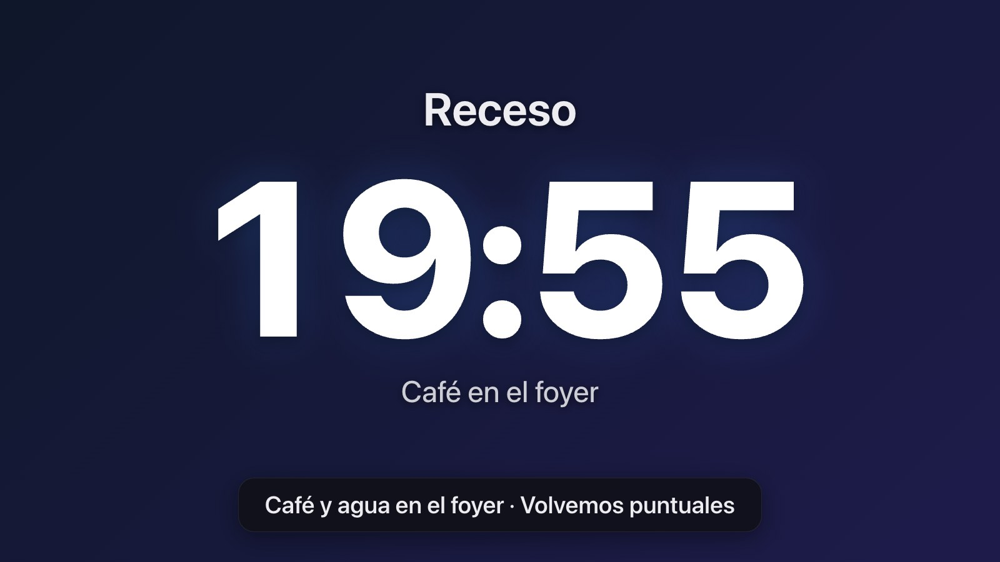

# Receso — Cuenta regresiva para conferencias

Aplicación portable para proyectar una cuenta regresiva durante recesos y antes de cada sesión. El público ve el tiempo restante en pantalla grande; el equipo técnico controla todo desde el celular o cualquier navegador en la misma red.

Se integra con **ProPresenter 7**, **Resolume Arena/Avenue** y **FreeShow**, y también puede salir por **OBS → NDI / Spout** con fondo transparente.

**⬇️ Descargar: [última versión en GitHub Releases](https://github.com/samuelsuarezok/PANEL-DE-CONTROL-RECESOS-/releases/latest)** → en *Assets* bajá el ZIP de tu sistema:
- `Receso-Windows.zip` — Windows 10/11
- `Receso-Mac-AppleSilicon.zip` — Mac con chip Apple (M1, M2, M3, M4)
- `Receso-Mac-Intel.zip` — Mac con procesador Intel

¿Qué Mac tengo? Menú Apple → *Acerca de esta Mac*: «Chip Apple M…» o «Procesador Intel». Los archivos «Source code» son el código fuente: no hacen falta para usar la app.



---

## 🚀 Inicio rápido (3 pasos)

1. Descargá el ZIP de tu sistema desde [Releases](https://github.com/samuelsuarezok/PANEL-DE-CONTROL-RECESOS-/releases/latest), descomprimilo y abrí con **doble clic** `receso.exe` (Windows) o `receso-mac-arm64` / `receso-mac-x64` (macOS). La primera vez Windows o macOS pueden pedir confirmación (ver *Solución de problemas*).
2. La consola muestra las direcciones y un **código QR**. Escanealo con el celular: abre directo el **Panel de control**.
3. En la PC del proyector abrí la dirección, tocá **Proyección** y poné pantalla completa (**tecla F**, doble clic o F11).

---

## 📱 Conectar dispositivos

- El celular o tablet tiene que estar en la **misma red** que la PC.
- Al abrir `http://IP-DE-LA-PC:3004` aparece una pantalla con botones:
  - **🎛️ Panel de control** → para el operador.
  - **🖥️ Proyección** → para la PC del proyector o LED.
  - **📺 Salida OBS / NDI** → fondo transparente para Resolume.
  - **📱 Conectar otro dispositivo** → QR grande y todas las direcciones (`/conectar`).
- Arriba a la derecha del panel se ve cuántas pantallas hay conectadas (🖥️ proyección · 📺 salida OBS · 📱 paneles). Si el proyector se desconecta, lo vas a ver ahí.

---

## 🎛️ Panel de control

### En vivo (arriba de todo)
- Muestra el tiempo real, el estado (**Detenido / En curso / Pausado / Terminado**) y una barra de progreso.
- **▶ Iniciar / ⏸ Pausar / ▶ Reanudar** en un solo botón.
- **↺ Reiniciar**: si la cuenta está corriendo pide **un segundo toque** (evita reinicios accidentales en pleno receso).
- **−5 / −1 / +1 / +5 min**:
  - Con la cuenta **detenida** cambian la duración configurada.
  - **Durante el receso** son ajustes temporales: «Reiniciar» vuelve a la duración original.
  - Si ya llegó a cero, **+5** da 5 minutos desde ese momento.
- Al bajar en la página aparece una **barra fija abajo** con el tiempo y el botón de iniciar/pausar.

### Plantillas
Tocá una plantilla y la cuenta se arma sola (no arranca hasta que toques Iniciar). «Guardar la configuración actual como plantilla» guarda modo, tiempo y textos; si el nombre ya existe, la reemplaza.

### Tiempo
| Modo | Cuándo usarlo | Ejemplo |
|------|---------------|---------|
| **Duración** | Sabés cuánto dura el receso | «Café 20 min» → 20:00 → 0 |
| **Hasta hora** | Sabés a qué hora empieza lo siguiente | «Culto 19:00» → cuenta hasta las 19:00 |

- La duración se aplica al salir del campo (o con Enter); también hay botones rápidos (5, 10, 15, 20, 30, 45, 60, 90).
- En «Hasta hora», si la hora ya pasó hace más de 12 h se toma la de mañana.

### Textos
- **Texto superior** (ej. «Volvemos en») e **inferior** (ej. «Próxima sesión · Pastor Juan»).
- **Mensaje al llegar a cero** (ej. «Estamos por comenzar»). Si lo dejás vacío queda **00:00**.

### Apariencia, anuncios y alertas
- **Fondo**: color, degradado (hay 6 sugeridos) o imagen. **Logo** de la conferencia. **Animación**: zoom lento o desplazamiento sutil.
- **Anuncios rotativos**: aparecen abajo en la proyección mientras corre el receso. Cada anuncio aparece cada «intervalo» y queda visible su «duración».
- **Alertas de color**: el tiempo pasa a **amarillo** y a **rojo** cuando queda poco (por defecto 5 y 1 min; 0 = desactivada).

### Archivos subidos
Logos y fondos quedan guardados en la carpeta `data/uploads`. Desde la lista podés reutilizarlos como **Logo** o **Fondo** sin volver a subirlos. Formatos: PNG, JPG, GIF, WEBP, AVIF, SVG (máx. 25 MB).

---

## 🖥️ Vista Proyección

- Dirección: `http://IP:3004/?view=projection`.
- **Pantalla completa**: tecla **F**, doble clic o F11. El cursor se oculta solo a los 3 segundos.
- Se adapta a cualquier resolución y formato (1920×1080, 4K, LED anchos o verticales).
- La cuenta se calcula en la propia pantalla con el reloj sincronizado: si se corta la red, **sigue contando exacto** y se reconecta sola.
- Si el navegador lo permite (abriendo por `localhost`), evita que la pantalla se apague.

### Atajos de teclado (proyección y salida OBS)
| Tecla | Acción |
|-------|--------|
| `Espacio` | Iniciar / Pausar |
| `R` | Reiniciar |
| `↑` / `↓` | +5 / −5 min |
| `→` / `←` | +1 / −1 min |
| `F` | Pantalla completa (proyección) |

---

## 🎬 Llevar la cuenta a Resolume

Hay tres caminos. Elegí uno:

| Camino | Necesita | Ventaja |
|--------|----------|---------|
| **A. Directo a Resolume** (texto nativo) | Solo Resolume | Sin OBS. El estilo (fuente, color, efectos) se hace en Resolume |
| **B. OBS → NDI / Spout** | OBS + plugin | Se ve exactamente igual que la proyección, con fondo transparente |
| **C. Vía ProPresenter o FreeShow** | ProPresenter/FreeShow con salida NDI | Si ya mandás esas salidas a Resolume |

### A. Directo a Resolume (sin OBS)

Receso escribe el tiempo en una fuente de texto de un clip de Resolume, una vez por segundo.

**Con REST (Resolume Arena/Avenue 7) — recomendado**
1. En Resolume: **Preferences → Webserver** → activá el webserver (puerto **8080**).
2. En la pestaña **Sources**, arrastrá un **Text Block** a un clip libre, por ejemplo **capa 2, columna 3**. Dale estilo (fuente, tamaño, color, posición, efectos) en Resolume.
3. En Receso → **🎛️ Resolume**: habilitá, elegí **REST**, poné la IP de la PC de Resolume (`localhost` si es la misma), puerto 8080, **Capa 2** y **Clip 3**.
4. **🔍 Probar conexión**: debe decir «Conectado a Resolume Arena 7.x · capa 2 / clip 3: parámetro «Text» listo». El texto del clip ya cambia.
5. Opcional: «Disparar el clip al iniciar el receso» y «Limpiar la capa al reiniciar».

**Con OSC (Resolume Arena 6 o 7)**
1. En Resolume: **Preferences → OSC** → activá **OSC Input** (puerto **7000**).
2. Cargá un **Text Block** (Arena 7) o un **Text Animator** (Arena 6 y 7) en el clip.
3. En Receso → Resolume: elegí **OSC**, puerto 7000, capa y clip, y el tipo de fuente. OSC no confirma la recepción: después de «Probar conexión» mirá que el texto haya cambiado en Resolume.
4. Si usás otra fuente de texto, elegí «Dirección OSC personalizada» y copiala desde Resolume (modo de edición OSC, clic en el campo de texto).

**Texto a enviar**: por defecto `{tiempo}` (el tiempo, o el mensaje final al llegar a cero). Podés usar `{arriba}` y `{abajo}` (los textos superior e inferior) y `\n` para saltos de línea, por ejemplo `{arriba}\n{tiempo}`.

### B. OBS → NDI / Spout (fondo transparente)

**1. URL de salida.** Copiala del panel (**Vista previa y salidas → 📺 Salida OBS / NDI**). Ejemplo:
```
http://IP:3004/salida?ancho=1920&alto=1080
```
| Parámetro | Valores |
|-----------|---------|
| `ancho`, `alto` | Tamaño del cuadro (por defecto 1920×1080; sirve para LED como 3840×1080) |
| *(sin estilo)* | Transparente con **contorno negro**: se lee sobre cualquier visual |
| `estilo=plano` | Transparente, colores puros sin contorno ni sombras (para keying) |
| `fondo=1` | Con el fondo configurado (color, degradado o imagen) |

También existe `/proyeccion?transparente=1`: la proyección sin fondo, logo ni anuncios, en colores puros.

> En el panel, el botón ↗ abre la salida con un **cuadriculado** para que veas la transparencia. Esa versión (`&vista=1`) es solo para mirar: en OBS usá la URL copiada.

**2. Fuente de navegador en OBS**
1. **Fuentes → + → Navegador**. Nombre: `RECESO`.
2. **URL**: la copiada. **Ancho/Alto**: los mismos de la URL.
3. **FPS personalizado**: 30 alcanza (el tiempo cambia una vez por segundo).
4. Dejá **desactivado** «Apagar la fuente cuando no es visible».
5. Aceptar. El fondo ya es transparente (alfa real), no hace falta chroma key.

**3a. NDI (Windows y Mac, también entre PCs)**
1. Instalá **DistroAV** (el plugin NDI actual de OBS) y el **NDI Runtime** que pide.
2. Clic derecho en la fuente `RECESO` → **Filtros** → **+** → **Dedicated NDI® output** (salida NDI dedicada) → nombre `RECESO`.
   > ⚠️ Usá el **filtro en la fuente**: la salida NDI *principal* de OBS no lleva transparencia (manda fondo negro).
3. En Resolume: pestaña **Sources → NDI** → arrastrá `RECESO` a un clip de una **capa por encima** de los visuales.
4. En esa capa, **Blend Mode: Alpha**. Si los bordes del texto se ven oscuros, cambiá el *Alpha Type* del clip (Premultiplied / Straight).

**3b. Spout (Windows, misma PC)**
1. Instalá el plugin **Spout2 para OBS**.
2. Clic derecho en la fuente `RECESO` → **Filtros** → **+** → **Spout Filter** → nombre `RECESO`.
3. En Resolume: **Sources → Spout** → arrastrá `RECESO` a un clip. Blend Mode **Alpha**.

**Mac con Syphon**: OBS no trae salida Syphon de fábrica (necesita un plugin aparte). En Mac es más simple usar **NDI** (paso 3a) o el camino **A** (directo a Resolume).

### C. Vía ProPresenter o FreeShow
Configurá la integración (abajo) y mandá la salida NDI de ProPresenter o FreeShow a Resolume (**Sources → NDI**).

---

## ⛪ Integración con ProPresenter 7

Receso mantiene **un timer de ProPresenter sincronizado** con su cuenta (duración, inicio alineado al segundo, pausa, ajustes y reinicio) y puede **mostrar un mensaje** de ProPresenter al iniciar. Así el timer aparece en pantallas de escenario, diapositivas o mensajes de ProPresenter exactamente igual que en Receso.

Requiere **ProPresenter 7.9 o superior** (API oficial).

1. En ProPresenter: **Preferencias → Red** → activá **Habilitar red** y anotá el **puerto** que aparece.
2. Creá un timer (por ejemplo `Receso`) en **Timers**. No importa su duración: la pone Receso.
3. Opcional: creá un **Mensaje** (por ejemplo `Cuenta Receso`) que muestre ese timer (token del timer en el texto del mensaje).
4. En Receso → **⛪ ProPresenter**: habilitá, poné la IP de la PC con ProPresenter (`localhost` si es la misma) y el puerto.
5. **🔍 Probar conexión y cargar timers**: se completan las listas de timers y mensajes. Elegí el **timer** y, si querés, el **mensaje**.
6. «Ocultar el mensaje al llegar a cero o al reiniciar» lo saca automáticamente.

| En Receso | En ProPresenter |
|-----------|-----------------|
| Iniciar / Reanudar | Pone el timer con el tiempo restante y lo arranca justo en el cambio de segundo; muestra el mensaje |
| Pausar | Detiene el timer en el tiempo restante |
| ±1 / ±5 min | Reajusta el timer |
| Reiniciar | Detiene el timer con la duración completa y oculta el mensaje |
| Llega a cero | Oculta el mensaje (si está marcado) |

Si ProPresenter no responde, Receso sigue funcionando igual; el estado se ve en el panel (punto verde/rojo).

---

## 🎭 Integración con FreeShow

FreeShow puede arrancar sus propios timers y mostrar overlays cuando inicia el receso.

1. En FreeShow: **Configuración → Conexiones → API** → activala. El puerto **REST** es **5506** (el 5505 es el de WebSocket y Receso no lo usa). Si ponés un token, copialo.
2. En FreeShow creá el **timer** (ej. `Receso 20 min`) y, si querés, un **overlay** que lo muestre (ej. `Timer Receso`).
3. En Receso → **🎭 FreeShow**: habilitá, IP, puerto 5506 y token → **Probar conexión**.
4. En «Timer y overlay por plantilla» elegí la plantilla y escribí los nombres **exactos** del timer y del overlay → **Guardar**.

| En Receso (con esa plantilla aplicada) | Acción en FreeShow |
|-----------------------------------------|--------------------|
| Iniciar | `name_start_timer` + `name_select_overlay` |
| Pausar / Reanudar | `name_pause_timer` / `name_start_timer` |
| Reiniciar | `name_stop_timer` (+ `clear_overlays` si está marcado) |
| Llega a cero | `clear_overlays` (si está marcado) |

La duración del timer se configura en FreeShow.

---

## 🔌 Control externo (Bitfocus Companion, Stream Deck, scripts)

API HTTP en el mismo puerto:

| Método | Ruta | Uso |
|--------|------|-----|
| `POST` | `/api/control` | Acciones. Cuerpo JSON, por ejemplo `{"action":"toggle"}` |
| `GET` | `/api/display` | Tiempo actual: `{"text":"12:34","phase":"running","alert":"none",...}` |
| `GET` | `/api/state` | Estado completo |
| `POST` | `/api/state` | Textos y apariencia, ej. `{"textTop":"Almuerzo"}` |

Acciones: `start`, `pause`, `toggle`, `reset`, `add_minutes` (`"value": 5`), `subtract_minutes`, `set_duration` (`"minutes": 20`), `set_until` (`"time": "19:00"`), `set_mode` (`"mode": "duration"` o `"until"`), `apply_template` (`"templateName": "Café 20 min"`).

En Companion: módulo **Generic HTTP** → *POST* a `http://IP:3004/api/control` con el cuerpo JSON.

---

## 💾 Portable: llevalo en un pendrive

Cada ZIP de Releases trae una carpeta `Receso` con el programa:
```
Receso/
├── receso.exe          (o receso-mac-arm64 / receso-mac-x64)
├── LEEME.txt           (instrucciones rápidas)
└── data/               (se crea al primer arranque, al lado del programa)
    ├── state.json      (estado actual)
    ├── config.json     (plantillas, alertas, integraciones)
    └── uploads/        (logos y fondos)
```
**Copiá la carpeta completa.** Los datos siempre se guardan en `data/` **al lado del ejecutable** (también en Mac al hacer doble clic). No lo abras desde adentro del ZIP: los datos se perderían.

Si lo compilás vos (`bun run build`), los tres ejecutables quedan en `dist/`; volver a compilar no borra `dist/data`.

---

## 🔧 Solución de problemas

**No puedo entrar desde el celular**
1. **Firewall de Windows**: al arrancar, Windows pregunta si permite la conexión: marcá **Redes privadas** → Permitir. Si dijiste que no: Configuración → Privacidad y seguridad → Seguridad de Windows → Firewall → Permitir una aplicación → `receso.exe` → Privada.
2. **Aislamiento de clientes** (redes de hoteles/venues): usá un router propio o el hotspot del celular.
3. **La IP cambió**: mirá la consola o abrí `/conectar` en la PC.
4. **Puerto ocupado**: si el 3004 está en uso, la app prueba 3005, 3006... (lo muestra la consola). Para cambiarlo, editá `"port"` en `data/config.json` y reiniciá.

**macOS no deja abrir el ejecutable**: en Terminal, dentro de la carpeta, `chmod +x receso-mac-*`. Si dice que no puede verificar al desarrollador (pasa cuando el archivo se descargó o llegó por AirDrop): **Configuración del Sistema → Privacidad y seguridad → «Abrir igualmente»**, o en Terminal `xattr -d com.apple.quarantine receso-mac-*`.

**El tiempo no coincide entre pantallas**: los relojes se sincronizan solos (precisión de milisegundos en red local). Recargá la página si una pantalla quedó vieja.

**Integraciones**: cada una muestra su estado (punto verde/rojo y el mensaje de error) en el panel y se revisa cada 10 s.
- ProPresenter «respondió 404»: activá **Habilitar red** en Preferencias → Red y revisá el puerto.
- Resolume «webserver respondió 404 / conexión rechazada»: activá **Preferences → Webserver** (Arena/Avenue 7), o usá OSC en Arena 6.
- Resolume «no tiene una fuente de texto»: ese clip necesita un **Text Block** o **Text Animator**; revisá capa y columna.
- FreeShow: el puerto REST es **5506**; si pusiste token en FreeShow, tiene que coincidir.

**Se ve fondo negro en Resolume (OBS)**: usá el **filtro Dedicated NDI output** en la fuente (no la salida principal), y Blend Mode **Alpha** en la capa.

---

## 📦 Requisitos

| Sistema | Qué necesitás |
|---------|---------------|
| Windows 10/11 (x64) | Nada, doble clic a `receso.exe` |
| macOS 12+ (Apple Silicon o Intel) | `chmod +x receso-mac-*` y doble clic (o desde Terminal) |
| Linux x64 | Compilar con `bun build --compile --target=bun-linux-x64 src/index.ts` (después de `bun run embed`) |

---

## 🛠️ Desarrollo

```bash
bun install          # dependencias
bun run dev          # compila el frontend y arranca el servidor (datos en ./data)
bun run embed        # solo compila el frontend (genera src/frontend/embed.ts)
bun run typecheck    # verificación de tipos (después de embed)
bun run build        # ejecutables para Windows y macOS en dist/ (en Mac los firma ad-hoc)
```

### Publicar una versión nueva
1. Subí el número de versión en `package.json` y `src/version.ts`, y agregá los cambios en `CHANGELOG.md` (sección `## vX.Y.Z`).
2. Confirmá los cambios y subí una etiqueta:
   ```bash
   git commit -am "Versión 1.2.0"
   git tag v1.2.0
   git push origin main v1.2.0
   ```
3. GitHub Actions compila en macOS los tres ejecutables, los firma, arma los ZIP y crea el *Release*. El link `releases/latest` siempre lleva a la última versión.

Variable opcional: `RECESO_DATA_DIR=/ruta/a/datos` para usar otra carpeta de datos.

```
src/
├── index.ts                    # Arranque
├── version.ts                  # Versión
├── types/index.ts              # Tipos compartidos
├── shared/time.ts              # Cálculo de tiempo (servidor y pantallas usan el mismo)
├── server/
│   ├── http.ts                 # HTTP, API REST, /conectar, archivos
│   ├── ws.ts                   # WebSocket: estado, sincronización de reloj, presencia
│   ├── engine.ts               # Motor de la cuenta (acciones, eventos, tick)
│   ├── data.ts                 # Persistencia JSON atómica y validación
│   ├── network.ts / qr.ts      # IPs y códigos QR
│   └── integrations/           # ProPresenter, Resolume (REST/OSC), FreeShow
└── frontend/
    ├── index.html, styles.css  # Interfaz
    ├── app.ts                  # Elige la vista según la URL
    ├── control.ts              # Panel de control
    ├── stage.ts                # Proyección y salida OBS
    ├── lib/                    # Conexión WebSocket y utilidades
    └── embed.ts                # AUTO-GENERADO por build-embed.ts (no editar)
```

---

## 📄 Licencia

Uso interno para conferencias. Código abierto para adaptación propia.

Desarrollado con **Bun** (runtime, bundler y compilador), **TypeScript** y **qrcode**. Sin dependencias nativas, 100 % offline, portable.
